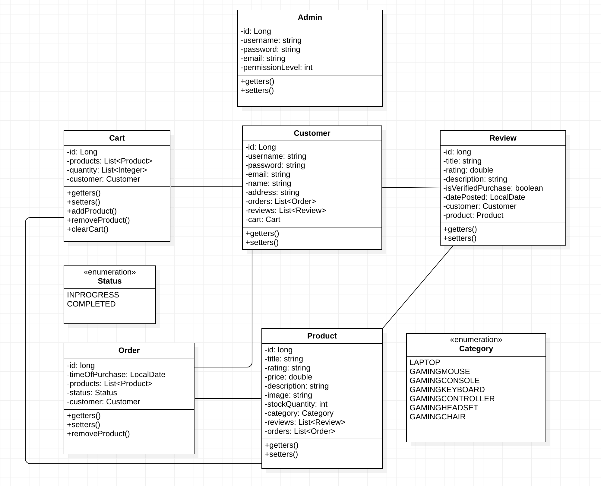
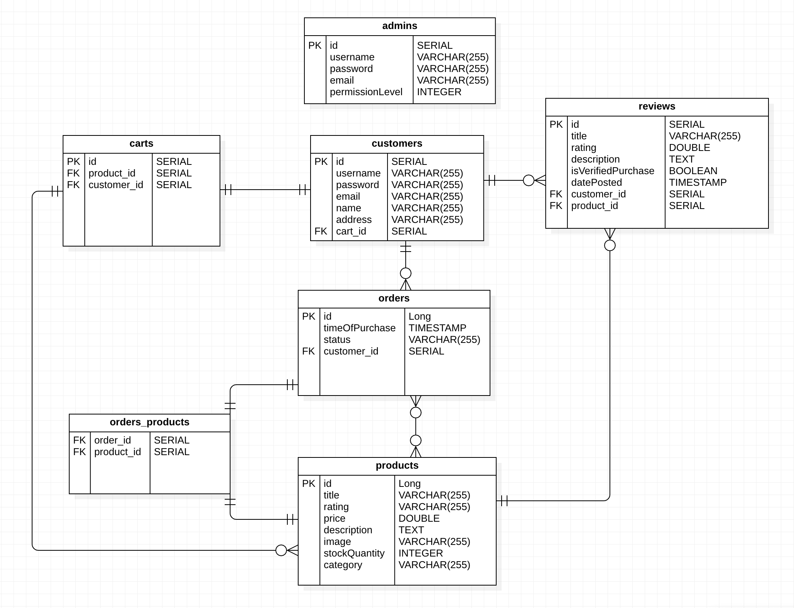

# READ ME (Pixelated Paradise- Capstone Project)

Note: This ReadMe provides a brief overview of the project– for a specific ReadMe of the frontend and backend subprojects, please refer to the links in [Project Structure](#project-structure)

#ADD LOGO IMAGE!!

As a gaming accessory specialist, we want to make your search easy... Here you can browse our vast collection and find all sorts of gaming accessories, from controllers to gaming headsets to gaming chairs! Fancy a new display to break the gaming experience? Wait no longer-  find your perfect match today with our various filters! Whether you’re a beginner or a pro gamer, there is something for everyone!

Take your gaming experience to the next level... choose Pixelated Paradise...

## Who we are:
We are the team behind Pixelated Paradise - 5 members of Cohort 5 from the Bright Network Technology Academy!

- Ana Paula Lima
    - Github: [https://github.com/AnaPaulaL27],
    - LinkedIn: [https://www.linkedin.com/in/ana-paula-l-5159a01b3/]

- Sabina Rafique
    - Github: [https://github.com/SabinaRafique],
    - LinkedIn: [https://www.linkedin.com/in/sabina-r-2021321ba/]

- Kim
    - Github: [https://github.com/JinleYe],
    - LinkedIn: https://www.linkedin.com/in/jinle-ye-6b133720a/

- Adan Abdillahi
    - Github: [https://github.com/AdanAbdillahi],
    - LinkedIn:https://www.linkedin.com/in/adan-abdillahi-93125a191/

- Iman Chaudhry
    - Github: [https://github.com/ImanChaudhry],
    - LinkedIn: [https://www.linkedin.com/in/imanchaudhry/] 

## Project Overview:
As part of the Bright Network Technology Academy, we were assigned a group project where the team was completely free to reign. The aim was  to design and build a full-stack application to provide a service or solve a problem, within a two week period. As a group we decided to create an application to provide a service.

Pixelated Paradise is a form of electronic commerce which allows consumers to directly buy gaming goods over the Internet using a web browser or a mobile app. The application permits shoppers to use "search" and "filter" features to find specific models, brands or items. Once a particular product has been found, the shopping cart feature allows consumers to accumulate multiple items and adjust quantities, just like filling a physical shopping cart or basket in a conventional store... Not keen on checking out? At Pixelated Paradise you can even sign up and sign in to save items for later purchase!

## Table of Contents:
- [Setup and Instructions](#setup-and-instructions-for-using-the-project)
- [Project Structure](#project-structure)
  - [Frontend](#frontend)
  - [Backend](#backend)
- [Further Implementations](#further-implementations)
- [Acknowledgements](#acknowledgments)

## Setup and Instructions for using the Project:

### Backend - Server-side
1. Make sure that you have Java 17/18 installed to run Pixelated Paradise Backend
2. Clone this repository by typing the following command into your terminal:  
   git clone git@github.com:JinleYe/online_store.git
3. You can access the endpoints via an API platform such as Postman or through the browser at https://localhost:8080/{endpoint}
4. You can also view the SQL tables by connecting to the h2 datatbase at localhost:8080/h2 and entering the following URL in the 'JDBC URL' section - jdbc:h2:file:./db/online_store. Note: spring.datasource.username=sa

### Frontend - Client-side

Once the repository has been cloned, open the 'frontend' folder in Visual Studio code (VSC) and run the following code in the
VSC in-built terminal:

- npm install
- npm install @ideal-postcodes/postcode-lookup
- npm install --save-dev @iconify/react
- npm install @material/textfield
- npm start

Please note, the front-end application should run on ‘localhost:3000’ unless you have another application running on this host - if so, you will have the option to run this on another host i.e. localhost:3001. This will not affect the running of the project.

## Project Structure:

### Frontend:
For this segment of the project, the team created a React application to act as a front-end for our Pixelated Paradise project (built in the server-side sub-project). Below you will find an image of our frontend homepage.

#### Homepage:

 

### Backend:

This segment of the project involved building the Pixelated Paradise API for the user to interact with. Below you will find images of our 'Unified Modelling Language Diagrams' and 'Entity Relationship Diagrams'.

#### Unified Modelling Language Diagrams (UML):

 

 

#### Entity Relationship Diagrams (ERD):

Please follow the links below for the ReadMe of the frontend and backend subprojects:

- Frontend Readme: https://github.com/JinleYe/online_store/blob/main/frontend/README.md
- Backend Readme: https://github.com/JinleYe/online_store/blob/main/backend/ReadMe.md

## Further Implementations:

In the future, we would like to build upon this project by implementing the following functionality/features:
- Chatbot feature
- Email the contents of the basket/order
- Admin functionality

## Acknowledgments:

We would like to thank the Bright Network Technology Academy team, and a special shouout to Iain, Anna and Richard!
